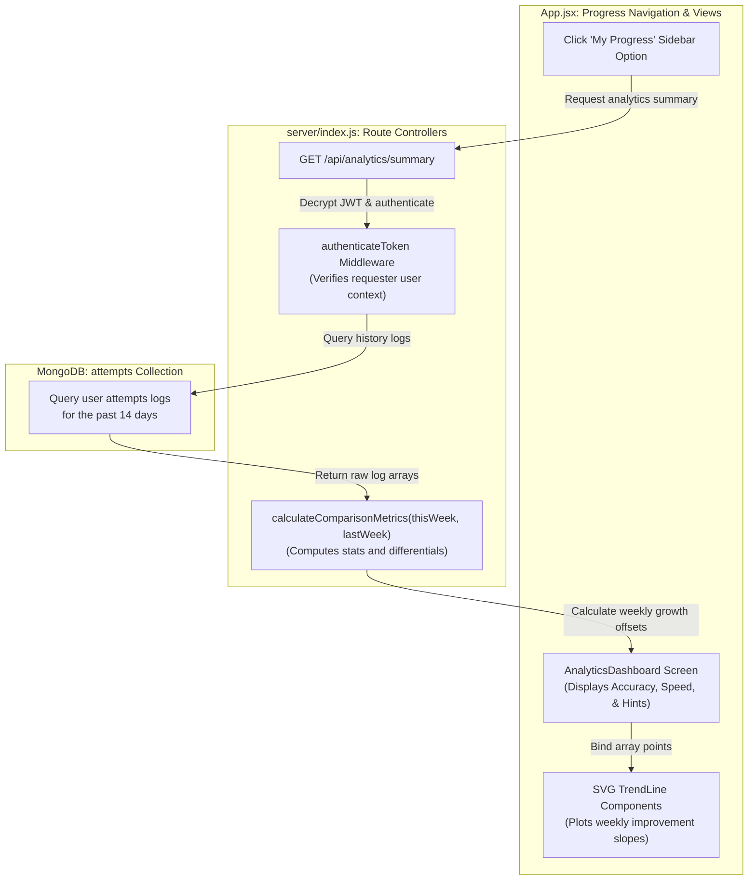

# Document: Feature Plan — Self-Progress Analytics Dashboard (Monolithic Layout)

This document details the architecture, required codebase changes, and step-by-step implementation plan for the **Self-Progress Analytics Dashboard (Feature AO)**.

---

## 1. Feature Specifications

- **Goal**: Render private, growth-oriented student charts showing accuracy, speed, and hint-usage improvements relative only to their past history.
- **Rules**:
  - Summarize attempts in weekly buckets.
  - Display comparison percentages (e.g. *"+14% Accuracy improvement"*).
  - No global or classmate comparison charts to avoid student discouragement.
  - Strict privacy checks: Students can only view their own analytics records.

### Self-Progress Analytics Dashboard Data Flow



---

## 2. Changes Required

### A. Backend (`server/index.js` Monolith)
- Append the `GET /api/analytics/summary` endpoint route directly above the client static serving fallback in `server/index.js` (around line 8910):
  ```javascript
  app.get('/api/analytics/summary', authenticateToken, async (req, res) => {
    const userId = req.user._id;
    const oneWeekAgo = new Date(Date.now() - 7 * 24 * 60 * 60 * 1000);
    const twoWeeksAgo = new Date(Date.now() - 14 * 24 * 60 * 60 * 1000);

    const thisWeekLogs = await db.attempts.find({ userId, createdAt: { $gte: oneWeekAgo } }).toArray();
    const lastWeekLogs = await db.attempts.find({ userId, createdAt: { $gte: twoWeeksAgo, $lt: oneWeekAgo } }).toArray();

    const comparisonData = calculateComparisonMetrics(thisWeekLogs, lastWeekLogs);
    res.json(comparisonData);
  });
  ```
- Write the `calculateComparisonMetrics` utility function directly inside the utilities section of `server/index.js`.
- Add token authorization validators to ensure students only query their own session summaries.

### B. Frontend (`client/src/App.jsx` Monolith)
- Append the new component `AnalyticsDashboard` directly inside `client/src/App.jsx` (around line 10000):
  - Renders dashboard blocks for Accuracy, Speed, and Hints.
  - Renders SVG lines plotting weekly performance trends.
- Register `"analytics"` inside `modeMap` and map it to `AnalyticsDashboard`.
- Update the navigation drawer menu within `client/src/App.jsx` to expose the `"My Progress"` link.

---

## 3. Database Design

### Target Collection:
- Read-only queries targeting `attempts` records.

### Indexes:
- Compound Index: `{ userId: 1, createdAt: -1 }`

---

## 4. API Specifications

### GET `/api/analytics/summary`
- **Request Headers**: `Authorization: Bearer [JWT_TOKEN]`
- **Response**:
  ```json
  {
    "accuracy": {
      "thisWeekPercent": 85.2,
      "improvementPercent": 14.1
    },
    "speed": {
      "thisWeekAvgSec": 12.4,
      "improvementSec": -8.2
    },
    "hints": {
      "thisWeekUsedCount": 3,
      "improvementPercent": -15.0
    }
  }
  ```

---

## 5. Step-by-Step Implementation Plan

```
Step 1: Database Index Setup ---> Step 2: server/index.js Metrics Logic ---> Step 3: API Endpoint Setup ---> Step 4: client/src/App.jsx View ---> Step 5: SVG Charts Setup
```

1. **Step 1: DB Index Configuration**: Seed user/date indexes to optimize log queries.
2. **Step 2: Server Utility Metrics**: Add `calculateComparisonMetrics` inside `server/index.js`.
3. **Step 3: Setup Server Endpoints**: Create the `/api/analytics/summary` route with JWT filters inside the server monolith.
4. **Step 4: Append View Component**: Code `AnalyticsDashboard` at the bottom of the screens segment inside `client/src/App.jsx`.
5. **Step 5: Render Progression SVG**: Draw weekly performance trend paths inside the view.

---

## 6. Verification Plan

### Automated Tests
- Test cases for `calculateComparisonMetrics`:
  - Empty history: returns baseline `0%` metrics.
  - Higher accuracy this week (80%) vs last week (70%): returns `improvementPercent = 14.28`.
  - Slower speeds this week (20s) vs last week (15s): returns `improvementSec = 5.0` (negative metric).

### Manual Verification
- Populate mock DB attempts logs for a user, log in, open the "My Progress" dashboard, and verify stats match predictions.
- Test endpoint requests with mismatched auth headers, validating that standard `401 Unauthorized` blocks are enforced.
