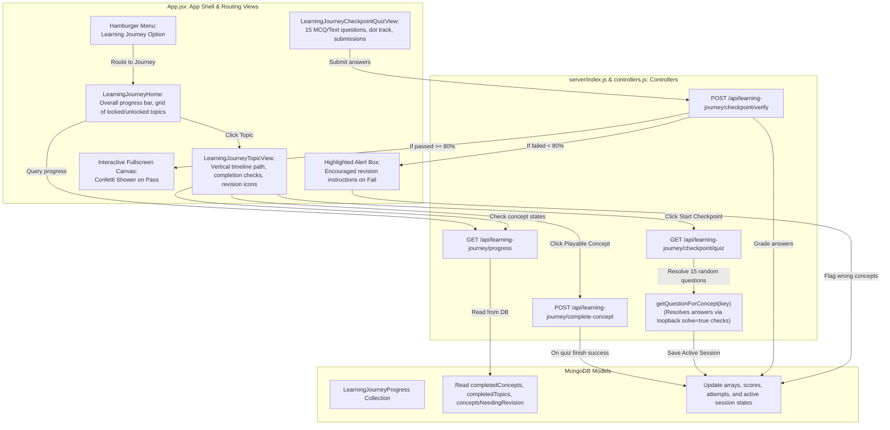

# Document: Feature Plan — Learning Checkpoints & Progression (Learning Journey)

This document serves as the absolute single source of truth for the **Learning Journey and Gated Checkpoints (Feature AL)**. It details the standalone architecture, database schemas, backend routing controllers, frontend layout timeline, canvas celebration animations, and targeted concept revision loop.

---

## 1. Feature Specifications

- **Goal**: Establish a structured, progressive learning journey that prevents cognitive overload by unlocking topics and concepts sequentially, and validating mastery through cumulative topic checkpoints.
- **Progression Rules**:
  - **Topic-Level Progression**: Topics must be unlocked in a strict sequential order (e.g., *Arithmetic Basics* must be cleared before *Advanced Arithmetic* is unlocked).
  - **Concept-Level Progression**: Within a topic, concepts are arranged in a timeline path. A concept is locked until all preceding concepts in that topic are successfully completed.
  - **Checkpoint Eligibility**: The topic's cumulative **Checkpoint Gate** unlocks only after all concepts within that topic are completed.
- **Checkpoint Gating**:
  - A checkpoint quiz consists of **15 questions** drawn randomly from the concepts of the active topic.
  - Correct answers are dynamically resolved from the server's monolithic question generators.
  - Unlocking successor topics requires scoring **80% or higher** (at least 12/15 questions correct).
  - **Confetti Celebration**: On passing a checkpoint, the UI triggers a fullscreen interactive canvas-based colorful confetti rain.
  - **Encouraging Failure Feedback**: On failing, the UI renders the header *"Oh no, it's okay"*, displays the score, and presents a highlighted instructions block advising revision.
- **Targeted Concept Revision Loop**:
  - If a student fails the checkpoint, the system tracks the concepts of any wrongly answered questions.
  - These failed concepts are flagged as **`needs_revision`** in the DB.
  - In the UI, revision-pending concepts are decorated with a **`⚠️ Revision Required`** badge, a dashed orange border, and a circular **`↻`** revision icon.
  - A concept's revision flag is cleared as soon as the student successfully completes that concept's individual quiz again.
  - Alternatively, if the user retries the checkpoint quiz and passes without revising, all revision flags for that topic are automatically cleared.

### Learning Journey & Checkpoint Flow Diagram



---

## 2. Changes Required

### A. Backend (`server/` Directory)

#### 1. Configuration (`server/lil/learning_journey/journeyData.js`)
- Houses the structural configuration of the Learning Journey:
  - `JOURNEY_CURRICULUM`: Static list defining domains/topics in order:
    1. `arithmetic_basics` (Addition, Basic Arithmetic, Multiplication, HCF & LCM, Decimals, Fractions, Rounding)
    2. `advanced_arithmetic` (Number Bases, Standard Form, Square Root, Percentages, Profit & Loss, Banking, GST, Shares & Dividends, Speed/Distance/Time, Variation)
    3. `algebra_foundations` (Linear Equations, Squaring, Indices, Functions, Ratio)
    4. `algebra_intermediate` (Polynomial Operations, Factoring, Prime Factors, Quadratics, quadratics formula, Simultaneous Equations, Remainder Theorem)
    5. `geometry_foundations` ... and other advanced domains.

#### 2. Models (`server/lil/learning_journey/models.js`)
- Defines schemas in Mongoose:
  - `CheckpointAttemptSchema`: Records history of quiz attempts.
  - `CheckpointQuestionSchema`: Persists questions generated for an active checkpoint session.
  - `ActiveCheckpointSchema`: Stores the active session, preventing session swaps or manipulation.
  - `LearningJourneyProgressSchema`: Main collection schema tracking completed topics, completed concepts, concepts needing revision, and attempt scores.

#### 3. Controller Logic (`server/lil/learning_journey/controllers.js`)
- Manages business logic and rules verification:
  - `getUserProgress(userId)`: Fetches or initializes user progress record.
  - `getTopicProgression(progress, topicId)`: Computes individual states (`locked`, `completed`, `playable`, `needs_revision`) for concepts and checks checkpoint gate eligibility.
  - `completeConcept(userId, topicId, conceptKey)`: Registers success on concept quizzes and clears the key from `conceptsNeedingRevision`.
  - `getQuestionForConcept(conceptKey)`: Queries standard question routes on the server. If an answer key is omitted in the response, it sends a loopback POST request to the check API with `solve=true` to dynamically resolve it.
  - `getCheckpointQuiz(userId, topicId)`: Generates 15 random concept questions, resolves correct answers, and saves them to the active session.
  - `verifyCheckpointQuiz(userId, topicId, answers)`: Grades submissions.
    - If passed ($\ge 80\%$): Unlocks successor topic, appends topic completion, and clears `conceptsNeedingRevision` for the topic.
    - If failed ($< 80\%$): Flags all concepts corresponding to wrong answers under `conceptsNeedingRevision`.

#### 4. API Endpoints (`server/index.js`)
- Registers routes to link controllers to the REST API:
  - `GET /api/learning-journey/progress`
  - `POST /api/learning-journey/complete-concept`
  - `GET /api/learning-journey/checkpoint/quiz`
  - `POST /api/learning-journey/checkpoint/verify`

---

### B. Frontend (`client/` Directory)

#### 1. Router & Context Navigation (`client/src/App.jsx`)
- Adds `learning_journey`, `learning_journey_topic`, and `learning_journey_checkpoint` routes to manage view states.
- Implements concept completion hook intercepts (`onBack` checking for final score elements to confirm successful quiz conclusion).

#### 2. View Components (`client/src/App.jsx`)
- **`LearningJourneyHome`**: Displays overall progress bar and responsive topic cards showing scores and padlocks.
- **`LearningJourneyTopicView`**: Renders the vertical timeline.
  - Renders concepts styled with an orange dashed border and a `⚠️ Revision Required` label if flagged as needing revision.
  - Timeline connector lines render as green for completed / revision-needed concepts.
  - Checkpoint Gate renders orange (eligible to start) or red (attempt failed).
- **`LearningJourneyCheckpointQuizView`**: Runs the 15-question checkpoint session.
  - Displays progress track dots.
  - Emits fullscreen confetti animation on score $\ge 80\%$.
  - Displays highlighted alert box with supportive failure message on score $< 80\%$.

#### 3. Styling & Animations (`client/src/App.css`)
- Embeds timeline connectors, slide transitions, hover scales, and responsive forms.

---

## 3. Database Design

### Collection: `learningjourneyprogresses`

```json
{
  "userId": "ObjectId (ref: User, unique, index)",
  "completedConcepts": ["String (conceptKeys)"],
  "completedTopics": ["String (topicIds)"],
  "conceptsNeedingRevision": ["String (conceptKeys)"],
  "checkpointAttempts": [
    {
      "topicId": "String",
      "scorePercent": "Number",
      "passed": "Boolean",
      "attemptedAt": "Date"
    }
  ],
  "latestCheckpointScore": "Map (topicId -> Number)",
  "activeCheckpoint": {
    "topicId": "String",
    "questions": [
      {
        "id": "String",
        "prompt": "String",
        "correctAnswer": "String",
        "conceptKey": "String"
      }
    ],
    "startedAt": "Date"
  },
  "updatedAt": "Date"
}
```

---

## 4. API Specifications

### GET `/api/learning-journey/progress`
- **Headers**: Authorization Bearer JWT
- **Response (200 OK)**:
  ```json
  {
    "completedConcepts": ["addition", "multiply"],
    "completedTopics": [],
    "conceptsNeedingRevision": ["basicarith"],
    "topics": [
      {
        "topicId": "arithmetic_basics",
        "unlocked": true,
        "completed": false,
        "checkpointEligible": false,
        "latestScore": null,
        "concepts": [
          { "key": "addition", "name": "Addition", "state": "completed" },
          { "key": "basicarith", "name": "Arithmetic (+, -, *)", "state": "needs_revision" },
          { "key": "multiply", "name": "Multiplication", "state": "playable" }
        ]
      }
    ]
  }
  ```

### POST `/api/learning-journey/complete-concept`
- **Payload**:
  ```json
  {
    "topicId": "arithmetic_basics",
    "conceptKey": "addition"
  }
  ```
- **Response (200 OK)**: Main progress document updated.

### GET `/api/learning-journey/checkpoint/quiz`
- **Request Query**: `topicId=arithmetic_basics`
- **Response (200 OK)**:
  ```json
  {
    "topicId": "arithmetic_basics",
    "questions": [
      { "id": "q-1", "prompt": "Solve: 12 + 15", "conceptKey": "addition" },
      { "id": "q-2", "prompt": "Round 4.829 to 2 decimal places.", "conceptKey": "rounding" }
    ]
  }
  ```

### POST `/api/learning-journey/checkpoint/verify`
- **Payload**:
  ```json
  {
    "topicId": "arithmetic_basics",
    "answers": {
      "q-1": "27",
      "q-2": "4.83"
    }
  }
  ```
- **Response (200 OK)**:
  ```json
  {
    "passed": true,
    "scorePercent": 100,
    "correctCount": 15,
    "totalQuestions": 15,
    "unlockedTopicId": "advanced_arithmetic",
    "results": [
      {
        "id": "q-1",
        "prompt": "Solve: 12 + 15",
        "userAnswer": "27",
        "correctAnswer": "27",
        "isCorrect": true
      }
    ]
  }
  ```

---

## 5. Verification Plan

### Automated Test Coverage
- Verifications are automated via specialized script runners (e.g. `test_revision.js`):
  - Check locking transitions for first/successor topics.
  - Block plays on locked concept keys.
  - Grade quizzes and assert score threshold logic ($<80\%$ flags failure, $\ge 80\%$ triggers pass).
  - Verify failed questions trigger `conceptsNeedingRevision` state transitions.
  - Verify complete concept revisions clear revision flags.
  - Verify retry checkpoint success clears all remaining topic flags.

### Manual Staging Checks
- Navigate to the **Learning Journey** dashboard from the header menu.
- Verify locks and sequential plays on concept timelines.
- Fail a checkpoint intentionally: check that wrong topics receive the warning badge (`⚠️ Revision Required`) and retry timeline icon (`↻`).
- Complete the checkpoint with $\ge 80\%$ correct answers: verify that fullscreen canvas confetti rains down, locks on the next topic dissolve, and all warning badges vanish.
