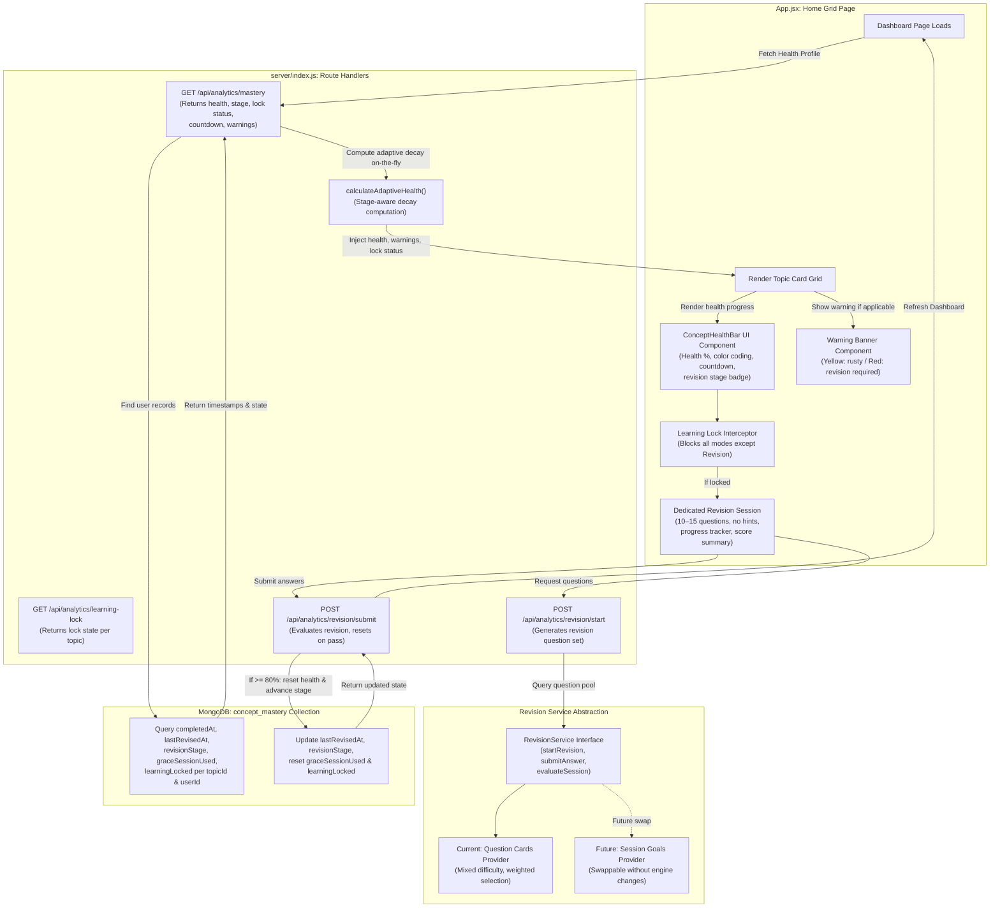

# Document: Feature Plan — Concept Health Decay Engine (Monolithic Layout)

This document details the architecture, required codebase changes, and step-by-step implementation plan for the **Concept Health Decay Engine (Feature AK)** — a lightweight spaced-repetition engine that models concept mastery as a decaying health bar and enforces structured revision cycles.

---

## 1. Feature Specifications

- **Goal**: Maintain long-term student retention by modeling concept mastery as a decaying visual health bar (0–100%) with adaptive spaced-repetition intervals, progressive warnings, grace sessions, learning locks, and dedicated revision sessions.
- **Decay Rules**:
  - After mastery, health starts at **100%** and decays according to the learner's current **revision stage**.
  - **Stage 0 (Initial Learning)**: 5% every 48 hours.
  - **Stage 1**: 3% every 72 hours.
  - **Stage 2**: 2% every 96 hours.
  - **Stage 3+**: 1% every 7 days.
  - Capped at a **minimum health of 40%** (health floor).
  - Successful revision resets health to **100%** and advances the revision stage.
- **Warning Levels**:
  - **Yellow Warning (50%)**: Informational — "This concept is becoming rusty. Consider revising soon."
  - **Red Warning (40%)**: Critical — "Revision Required". Health has reached the floor.
- **Grace Session**: When health first reaches 40%, the learner is allowed exactly **one** grace learning session. After that session ends, if revision has not been completed, all learning modes are locked except Revision Mode.
- **Learning Lock**: Prevents new lesson generation, practice sessions, Session Goals, and all other learning modes. Only Revision Mode remains accessible.
- **Revision Session**: A dedicated 10–15 question session with mixed difficulty, no hints, higher weight for previously incorrect questions, a progress indicator, and a final score summary. Pass threshold: **80%** (e.g., 8/10 correct). Failure keeps health at 40% and topic locked; the learner may retry immediately with reshuffled questions.
- **Validation**: Calculate decay dynamically on the server using elapsed milliseconds from the stored baseline timestamp. **No cron jobs**. Health is always computed on demand.

### Educational Basis

The design of the Concept Health Decay Engine is inspired by established learning science principles:

- **Hermann Ebbinghaus — Forgetting Curve**: Memory retention decays exponentially over time without reinforcement. The health bar models this decay visually.
- **Roediger & Karpicke — Retrieval Practice / Testing Effect**: Actively recalling information strengthens long-term memory more effectively than passive review. The revision quiz enforces active retrieval.
- **Piotr Woźniak — Spaced Repetition (SuperMemo)**: Optimal review intervals increase after each successful retrieval. The adaptive decay stages implement this principle with progressively longer intervals.

> **Note**: This is a simplified implementation inspired by these principles rather than a full SM-2 algorithm. The stage-based interval system provides the core benefits of spaced repetition within the constraints of the Tenali monolithic architecture.

### Concept Health Decay Architecture Diagram



---

## 2. Changes Required

### A. Backend (`server/index.js` Monolith)

- Add adaptive decay calculation helper at the bottom utility section:
  ```javascript
  /**
   * Decay stage configuration.
   * Each stage defines the percentage lost per interval and the interval duration.
   */
  const DECAY_STAGES = [
    { stage: 0, label: 'Initial Learning', decayPercent: 5, intervalMs: 48 * 60 * 60 * 1000 },
    { stage: 1, label: 'Revision 1',       decayPercent: 3, intervalMs: 72 * 60 * 60 * 1000 },
    { stage: 2, label: 'Revision 2',       decayPercent: 2, intervalMs: 96 * 60 * 60 * 1000 },
    { stage: 3, label: 'Revision 3+',      decayPercent: 1, intervalMs: 7 * 24 * 60 * 60 * 1000 }
  ];

  const HEALTH_FLOOR = 40;
  const REVISION_PASS_THRESHOLD = 0.80;
  const REVISION_QUESTION_COUNT = 10;

  /**
   * Calculates current concept health using adaptive stage-based decay.
   * Uses elapsed milliseconds — no cron jobs.
   *
   * @param {Date|string} lastRevisedAt - Timestamp of last successful revision.
   * @param {Date|string} completedAt   - Timestamp of initial mastery completion.
   * @param {number}      revisionStage - Current revision stage (0, 1, 2, 3+).
   * @returns {{ health: number, stageConfig: object, msUntilNextDecay: number }}
   */
  function calculateAdaptiveHealth(lastRevisedAt, completedAt, revisionStage = 0) {
    const baselineTime = lastRevisedAt || completedAt;
    if (!baselineTime) return { health: 0, stageConfig: DECAY_STAGES[0], msUntilNextDecay: 0 };

    const stageIndex = Math.min(revisionStage, DECAY_STAGES.length - 1);
    const stageConfig = DECAY_STAGES[stageIndex];

    const elapsedMs = Date.now() - new Date(baselineTime).getTime();
    const fullIntervals = Math.floor(elapsedMs / stageConfig.intervalMs);
    const health = Math.max(HEALTH_FLOOR, 100 - (fullIntervals * stageConfig.decayPercent));

    // Time remaining until the next decay tick
    const msIntoCurrentInterval = elapsedMs % stageConfig.intervalMs;
    const msUntilNextDecay = health > HEALTH_FLOOR
      ? stageConfig.intervalMs - msIntoCurrentInterval
      : 0;

    return { health, stageConfig, msUntilNextDecay };
  }

  /**
   * Determines the warning level for a given health value.
   * @param {number} health - Current health percentage (0–100).
   * @returns {{ level: string, message: string } | null}
   */
  function getWarningLevel(health) {
    if (health <= 40) {
      return { level: 'red', message: 'Revision Required' };
    }
    if (health <= 50) {
      return { level: 'yellow', message: 'This concept is becoming rusty. Consider revising soon.' };
    }
    return null;
  }

  /**
   * Checks whether a topic is learning-locked for a user.
   * A topic is locked when graceSessionUsed is true and revision has not been completed.
   *
   * @param {object} masteryDoc - The concept_mastery document.
   * @returns {boolean}
   */
  function isLearningLocked(masteryDoc) {
    return masteryDoc.learningLocked === true;
  }

  /**
   * Evaluates a revision session submission.
   * @param {Array<{ questionId: string, isCorrect: boolean }>} answers
   * @returns {{ passed: boolean, score: number, total: number, percentage: number }}
   */
  function evaluateRevisionSession(answers) {
    const total = answers.length;
    const score = answers.filter(a => a.isCorrect).length;
    const percentage = total > 0 ? score / total : 0;
    return {
      passed: percentage >= REVISION_PASS_THRESHOLD,
      score,
      total,
      percentage: Math.round(percentage * 100)
    };
  }
  ```

- Add the `GET /api/analytics/mastery` route handler:
  - Query the `concept_mastery` collection for all mastered topics for the authenticated user.
  - For each record, compute dynamic health using `calculateAdaptiveHealth`, derive warning level, check lock status, and calculate estimated countdown to next revision.
  - Return enriched response with health, warnings, stage info, lock status, and countdown.

- Add the `GET /api/analytics/learning-lock` route handler:
  - Query a specific topic's mastery record.
  - Return whether the topic is currently learning-locked and the reason.

- Add the `POST /api/analytics/revision/start` route handler:
  - Verify the topic exists and the user has a mastery record.
  - Query `attempts` collection for the topic to find previously incorrect questions.
  - Generate a set of 10–15 revision questions with mixed difficulty and higher weight for previously failed question types.
  - Return the question set (no hints included).

- Add the `POST /api/analytics/revision/submit` route handler:
  - Accept the array of answers for the revision session.
  - Evaluate using `evaluateRevisionSession`.
  - If **passed** (≥ 80%):
    - Reset `lastRevisedAt` to `new Date()`.
    - Increment `revisionStage` by 1.
    - Set `learningLocked` to `false`.
    - Set `graceSessionUsed` to `false`.
    - Set `revisionRequired` to `false`.
    - Return success with `conceptRestored: true` and new health of 100%.
  - If **failed**:
    - Health remains at 40%.
    - `learningLocked` remains `true`.
    - Return failure with score details and `retryAllowed: true`.

- Add grace session enforcement logic:
  - When a learning session completes on a topic at 40% health where `graceSessionUsed` is `false`:
    - Set `graceSessionUsed` to `true`.
  - When a learning session is requested on a topic at 40% health where `graceSessionUsed` is `true`:
    - Set `learningLocked` to `true`.
    - Return a lock response indicating only Revision Mode is available.

### B. Frontend (`client/src/App.jsx` & `App.css` Monoliths)

#### Dashboard — Concept Health Card
- Add `.health-bar-container`, `.health-bar`, and health color classes directly inside `client/src/App.css`:
  - `.health-green` (80–100%): Green gradient fill.
  - `.health-yellow` (50–79%): Yellow/amber gradient fill.
  - `.health-red` (40–49%): Red gradient fill.
- Render within each mastered topic card:
  - Health percentage text and animated bar.
  - Estimated revision countdown (e.g., "Next revision in 2d 5h").
  - Last revision timestamp (e.g., "Last revised: 3 days ago").
  - Revision stage badge (e.g., "Stage 2 — Revision 2").

#### Dashboard — Warning Banners
- **Yellow Warning Banner**: Displayed when health is 50% or below. Subtle amber banner with message: "This concept is becoming rusty. Consider revising soon." Learning remains unrestricted.
- **Red Warning Banner**: Displayed when health reaches 40%. Bold red banner with message: "Revision Required". Includes a "Start Revision" call-to-action button.

#### Revision Required Screen (Locked State)
- When a topic is learning-locked (`learningLocked === true`):
  - Overlay the topic card with a lock icon.
  - On click, show a dedicated "Revision Required" screen:
    - Explanation of why learning is paused ("This concept has decayed and requires revision before you can continue learning.")
    - Current health (40%) and revision stage info.
    - "Start Revision" button that launches the Revision Session.
    - No access to other learning modes from this screen.

#### Revision Session UI
- Register `"revision"` mode in `modeMap`.
- Build the `RevisionSessionView` component within `client/src/App.jsx`:
  - **Progress Tracker**: "Question 3 of 10" progress bar.
  - **Question Display**: Mixed-difficulty questions, no hint button rendered.
  - **Answer Submission**: Standard answer input and submit flow.
  - **Score Summary**: After all questions answered, display:
    - Total score (e.g., "8/10 — 80%").
    - Pass/fail status.
  - **Success State**: If passed, display "Concept Restored!" success animation/message and return to dashboard with refreshed health.
  - **Failure State**: If failed, display score with "You need 80% to pass. Try again?" and a "Retry Revision" button. Question selection reshuffles on retry.

---

## 3. Database Design

### Extended Fields in `concept_mastery` Collection:
| Field               | Type     | Description                                                        |
|---------------------|----------|--------------------------------------------------------------------|
| `completedAt`       | Date     | Timestamp of initial topic mastery.                                |
| `lastRevisedAt`     | Date     | Timestamp of last successful revision.                             |
| `revisionStage`     | Number   | Current spaced-repetition stage (0 = Initial, 1+  = Revision N). Defaults to `0`. |
| `graceSessionUsed`  | Boolean  | Whether the one-time grace session has been consumed. Defaults to `false`. |
| `learningLocked`    | Boolean  | Whether all learning modes (except Revision) are locked. Defaults to `false`. |
| `revisionRequired`  | Boolean  | Whether the concept has reached 40% and requires revision. Defaults to `false`. |

### Indexes:
- Compound Index: `{ userId: 1, topicId: 1 }` (Unique)
- Sparse Index: `{ userId: 1, learningLocked: 1 }` (for efficient lock-check queries)

---

## 4. API Specifications

### GET `/api/analytics/mastery`
- **Request**: None (Authenticates via session header).
- **Response**:
  ```json
  [
    {
      "topicId": "fractionadd",
      "isMastered": true,
      "completedAt": "2026-06-25T10:00:00Z",
      "lastRevisedAt": "2026-06-28T12:00:00Z",
      "conceptHealth": 85,
      "healthColor": "green",
      "revisionStage": 1,
      "revisionStageLabel": "Revision 1",
      "warning": null,
      "learningLocked": false,
      "graceSessionUsed": false,
      "msUntilNextDecay": 172800000,