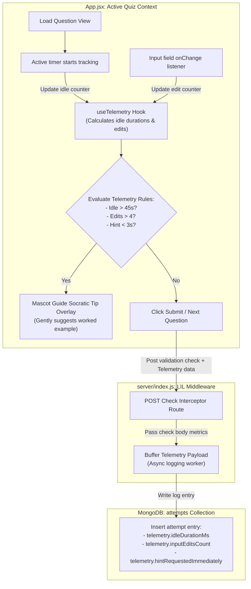

# Document: Feature Plan — Smart Frustration & Pause Detection (Monolithic Layout)

This document details the architecture, required codebase changes, and step-by-step implementation plan for the **Smart Frustration & Pause Detection (Feature AM)**.

---

## 1. Feature Specifications

- **Goal**: Help students who are struggling in silence by monitoring their telemetry inputs and offering Socratic mascot pointers or suggesting study breaks before they exit the site.
- **Triggers**: Frustration flag set to `true` on the client when:
  - Student is idle for **>45 seconds** on a single question.
  - Student makes **>4 input edits** (e.g. typing, clearing, typing again) on the active field.
  - Student immediately requests a hint or solve walkthrough within **3 seconds** of loading a question.
- **Intervention**:
  - Mascot Guide overlay slides in with a Socratic prompt (e.g., *"Let's look at a similar worked example together!"*).
  - Offers a screen-break notification/overlay if frustration occurs multiple times in a row.
  - Interventions **must not** modify the mathematical scoring of the active attempt.

### Smart Frustration & Telemetry Data Flow



---

## 2. Changes Required

### A. Frontend (`client/src/App.jsx` Monolith)
- Append the `useTelemetry` hook inside the Hooks section directly below `useTimer` (around line 400):
  ```javascript
  function useTelemetry(questionId) {
    const [idleTime, setIdleTime] = useState(0);
    const [edits, setEdits] = useState(0);
    const [frustrated, setFrustrated] = useState(false);
    const lastInputTime = useRef(Date.now());
    const inputCount = useRef(0);

    useEffect(() => {
      setIdleTime(0);
      setEdits(0);
      setFrustrated(false);
      lastInputTime.current = Date.now();
      inputCount.current = 0;

      const idleInterval = setInterval(() => {
        const elapsed = (Date.now() - lastInputTime.current) / 1000;
        setIdleTime(elapsed);
        if (elapsed > 45) setFrustrated(true);
      }, 1000);

      return () => clearInterval(idleInterval);
    }, [questionId]);

    const registerEdit = () => {
      inputCount.current += 1;
      setEdits(inputCount.current);
      lastInputTime.current = Date.now();
      if (inputCount.current > 4) setFrustrated(true);
    };

    return { idleTime, edits, frustrated, registerEdit };
  }
  ```
- Integrate `useTelemetry` within the central question prompt panel inside `client/src/App.jsx`. Bind text fields to call `registerEdit` on change event triggers.
- Bind the Mascot component's modal visibility to the `frustrated` hook variable.

### B. Backend (`server/index.js` Monolith)
- Update the unified LIL interceptor middleware to inspect incoming payloads:
  - If a POST query is sent to `/check`, parse the `telemetry` payload object.
  - Asynchronously save time logs, edit counts, and hesitation flags inside the `attempts` collection in MongoDB.

---

## 3. Database Design

### Extended Fields in `attempts` Collection:
- `telemetry.idleDurationMs`: Number
- `telemetry.inputEditsCount`: Number
- `telemetry.hintRequestedImmediately`: Boolean

---

## 4. API Specifications

### POST `/api/[topic]/check` (Updated Schema)
- **Request Body**:
  ```json
  {
    "userAnswer": "85",
    "solve": false,
    "telemetry": {
      "timeSpentMs": 52000,
      "inputEditsCount": 5,
      "hintRequestedImmediately": false,
      "idleDurationMs": 48000
    }
  }
  ```
- **Response Body**:
  ```json
  {
    "correct": false,
    "correctAnswer": "90",
    "message": "Incorrect",
    "acknowledgedTelemetry": true
  }
  ```

---

## 5. Step-by-Step Implementation Plan

```
Step 1: Telemetry Hook Setup ---> Step 2: Input Field Binding ---> Step 3: Mascot Trigger ---> Step 4: Interceptor Payload ---> Step 5: Database Logger
```

1. **Step 1: Telemetry Hook Setup**: Write the `useTelemetry` logic block inside the hooks utility segment of `client/src/App.jsx`.
2. **Step 2: Bind UI Text Inputs**: Bind input controls within active quiz layouts to register characters entries as changes.
3. **Step 3: Mascot Dialog Connection**: Connect the Mascot guides container to check the hook's active status.
4. **Step 4: Update HTTP Clients**: Update client submission functions inside `App.jsx` to append telemetry headers/payload.
5. **Step 5: Middleware Database Storage**: Process and log incoming metrics within the server interceptor inside `server/index.js`.

---

## 6. Verification Plan

### Automated Tests
- Test telemetry trigger values:
  - Input edits: 3 -> returns `frustrated = false`.
  - Input edits: 5 -> returns `frustrated = true`.
  - Idle time: 40s -> returns `frustrated = false`.
  - Idle time: 46s -> returns `frustrated = true`.

### Manual Verification
- Open any quiz, remain completely idle for 46 seconds, and check if the mascot guide slides in.
- Type and delete answers 5 times, check if the frustration guide pops up.
