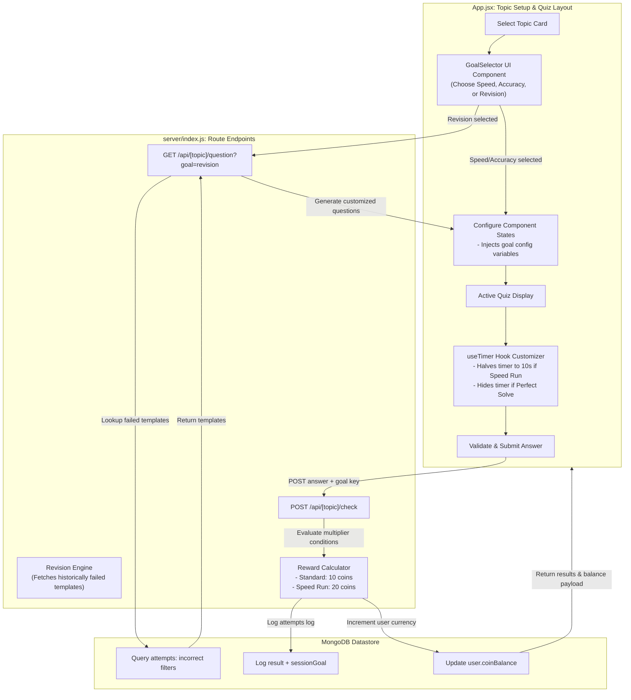

# Document: Feature Plan — Goal-Based Practice Sessions (Monolithic Layout)

This document details the architecture, required codebase changes, and step-by-step implementation plan for **Goal-Based Practice Sessions (Feature AN)**.

---

## 1. Feature Specifications

- **Goal**: Enable students to customize their study targets by selecting session goals before launching a topic quiz.
- **Goal Types**:
  - **Speed Run**: Halves default timers, double coins for correct answers. Timed-out questions yield zero coins.
  - **Perfect Solve**: Hides the timer. Student must answer 100% correctly (first attempt) to pass the level.
  - **Revision**: Quiz prioritizing misconception templates previously failed by the student.

### Goal-Based Practice Session Life Cycle



---

## 2. Changes Required

### A. Frontend (`client/src/App.jsx` Monolith)
- Append the `GoalSelector` component directly inside the quiz parameters container layout inside `client/src/App.jsx`.
- Update state mapping variables to propagate the selected `sessionGoal` to downstream hooks.
- Modify the `useTimer` hook configuration inside the file:
  - If goal is `"speed"`, set countdown ceiling to `10s` (or half baseline), invoking validation timeout on 0.
  - If goal is `"perfect"`, block stopwatch indicators.
- Wire coin reward splash indicators to display multipliers received from HTTP headers.

### B. Backend (`server/index.js` Monolith)
- Extend the `GET /api/[topic]/question` route logic inside `server/index.js` (lines 8800+) to support `goal=revision`:
  - Locate previously logged failure templates matching the topic.
  - Inject identical misconception parameter objects into the response container.
- Update checking route POST body inspectors:
  - Calculate `coinsEarned` depending on goal conditions (e.g. `baseCoins * 2` for Speed Run).
  - Immediately set level failure flag if any incorrect submission occurs in Perfect Solve.

---

## 3. Database Design

### Extended Fields:
- `attempts.sessionGoal`: String ("speed" | "accuracy" | "revision")
- `users.coinBalance`: Number (Accumulated currency balance)

---

## 4. API Specifications

### GET `/api/[topic]/question?difficulty=easy&goal=revision`
- **Request**: Sends goal parameters.
- **Response**: Generates a question modeled around historical problem topics.

### POST `/api/[topic]/check`
- **Request Body**:
  ```json
  {
    "userAnswer": "12",
    "goal": "speed",
    "timeSpentMs": 4000
  }
  ```
- **Response Body**:
  ```json
  {
    "correct": true,
    "coinsEarned": 20,                // Multiplied reward
    "message": "Correct!"
  }
  ```

---

## 5. Step-by-Step Implementation Plan

```
Step 1: Goal Selectors UI ---> Step 2: useTimer Update ---> Step 3: Server Payout Multiplier ---> Step 4: Revision Queue Loader
```

1. **Step 1: Append Selector to App.jsx**: Code the `GoalSelector` buttons grid within the setup menu block in `client/src/App.jsx`.
2. **Step 2: Update useTimer Hook**: Configure timer parameters to support speed timeouts inside `App.jsx`.
3. **Step 3: server/index.js Payout Rules**: Implement multiplier multipliers within the validation route checks of `server/index.js`.
4. **Step 4: Revision Quiz Generator**: Integrate historical attempt search routines into the question creators inside the server index file.

---

## 6. Verification Plan

### Automated Tests
- Test cases for Payout Calculator:
  - Standard check: correct answer -> returns `10 coins`.
  - Speed Run check: correct answer within 10s -> returns `20 coins`.
  - Speed Run check: correct answer after 12s -> returns `0 coins` (timeout).
  - Perfect Solve check: incorrect answer on question 3 -> returns `levelFailed = true`.

### Manual Verification
- Start a "Speed Run" session, confirm the 10-second timer restriction on-screen, and check that correct attempts trigger double payouts (+20 coins).
- Start a "Perfect Solve" session, trigger one incorrect check, and verify the quiz exits immediately with a failure message.
