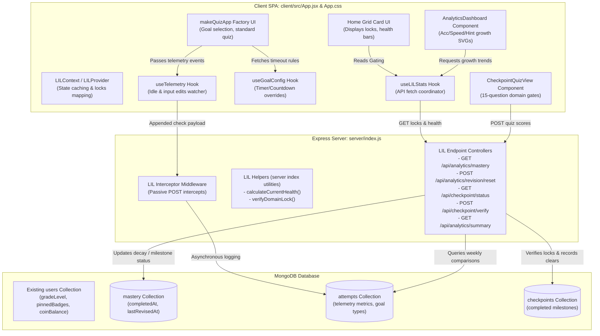

# Document: Learning Intelligence Layer (LIL) Architecture Specification (Monolithic Layout)

This document defines the architecture, data schemas, API interfaces, and integration flow of the shared **Learning Intelligence Layer (LIL)**, adjusted for the monolithic layout of the Tenali platform.

---

## 1. Overview & Architectural Role

Following the design system of the codebase, the LIL will not be created as separate external service files. Instead, all server-side LIL helper functions and routes will be placed directly within the monolithic **`server/index.js`**, and all client-side hooks, state contexts, and UI views will reside within **`client/src/App.jsx`** (with styling in **`client/src/App.css`**).

This monolithic integration ensures that:
- The backend remains a single self-contained application file.
- The client routes, states, and factories are bundled together, avoiding file scattering.

### Shared LIL Monolithic Flowchart



---

## 2. Server-Side Monolithic Integration (`server/index.js`)

All LIL backend helpers, models, and endpoints are appended directly inside `server/index.js` under a dedicated block: `// ─── LEARNING INTELLIGENCE LAYER (LIL) SERVICES ────────────────────────────`.

### A. Placement Guide
1. **Helper Functions & Database Adapters**: Placed alongside the existing server utilities (`gcd`, `toMixed`, etc.), around line 6800.
2. **LIL Middleware**: Positioned directly below the existing `solveMiddleware` (around line 120) to intercept validations.
3. **Analytics API Endpoints**: Appended at the end of the file, directly above the catch-all `app.get(/.*/)` routing (around line 8910).

### B. Database Schema Definitions (MongoDB)
The LIL collections are managed by the unified MongoDB client initialized in `server/auth.js`.

#### 1. `attempts` Collection
```javascript
// Schema reference for raw submissions logged asynchronously
{
  _id: ObjectId,
  userId: ObjectId,                // Ref to users
  topicId: String,                  // Topic key
  difficulty: String,               // easy | medium | hard | extrahard
  userAnswer: String,
  isCorrect: Boolean,
  sessionGoal: String,              // speed | accuracy | revision
  telemetry: {
    timeSpentMs: Number,
    inputEditsCount: Number,
    hintRequestedImmediately: Boolean,
    idleDurationMs: Number
  },
  createdAt: Date
}
```

#### 2. `mastery` Collection
```javascript
// Schema reference for topic completion tracking
{
  _id: ObjectId,
  userId: ObjectId,
  topicId: String,
  isMastered: Boolean,
  completedAt: Date,
  lastRevisedAt: Date,
  incorrectStreak: Number
}
```

#### 3. `checkpoints` Collection
```javascript
// Schema reference for domain gating states
{
  _id: ObjectId,
  userId: ObjectId,
  domainId: String,                 // arithmetic | algebra | geometry | calculus | stats | vecmat
  isCompleted: Boolean,
  completedAt: Date,
  scorePercent: Number
}
```

---

## 3. Client-Side Monolithic Integration (`client/src/App.jsx`)

All LIL hooks, providers, and dashboard screens will be integrated into the monolithic `client/src/App.jsx`.

### A. Placement Guide
1. **Hooks (`useTelemetry`, `useGoalConfig`)**: Appended in the Hooks section of the file, directly below `useTimer` (around line 400).
2. **Dashboard Component (`AnalyticsDashboard`)**: Integrated directly below the specialized app components (around line 10000).
3. **Routing Node (`modeMap` & `regularApps`)**: Add the dashboard mode `"analytics"` and checkpoint mode `"checkpoint"` directly to the `modeMap` registry and `regularApps` card array.

### B. state Context Wrapper
A `LILContext` and corresponding `<LILProvider>` will surround the main `<App>` router component inside `client/src/App.jsx` to cache active gating maps and session stats.

---

## 4. API Endpoints Catalog

LIL features communicate using new endpoints appended to the server:

* `GET /api/analytics/mastery` -> Retrieves mastered list and dynamically computes health decay.
* `POST /api/analytics/revision/reset` -> Triggered on revision success to reset decay tracking timestamps.
* `GET /api/checkpoint/status` -> Fetches user lock parameters.
* `POST /api/checkpoint/verify` -> Grades checkpoint quizzes and unlocks successor domains.
* `GET /api/analytics/summary` -> Computes weekly improvement differentials for the progress dashboard.

---

## 5. Non-Disruptive Middleware Flow

To record logs without altering the existing 59+ endpoint controllers, a passive interceptor is registered:

```javascript
// server/index.js (LIL Interceptor Middleware)
app.use((req, res, next) => {
  if (req.method !== 'POST' || !req.path.includes('-api/check')) return next();
  
  const originalJson = res.json.bind(res);
  res.json = function(data) {
    // Intercept check result and run LIL updates in the background
    if (req.body && !req.body.solve) {
      logAttemptAsync(req.user?._id, req.path, req.body, data)
        .catch(err => console.error('[LIL] Attempt log failed:', err));
    }
    return originalJson(data);
  };
  next();
});
```
This intercepts incoming answers, routes statistics to MongoDB, updates streaks, and returns responses seamlessly.
