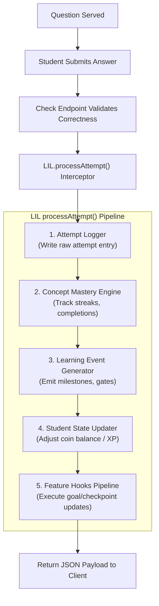

# LIL Implementation Plan: Shared Learning Intelligence Layer (Feature-First Workflow)

This document is the master implementation plan and technical specification for the **Learning Intelligence Layer (LIL)** of the Tenali platform. It serves as the single source of truth for engineering the LIL and its features incrementally.

---

## Implementation Flow

To align with our incremental pull-request workflow, development is structured into five feature-oriented phases. Each phase (Chunk) includes both the infrastructure additions to the LIL and the user-facing feature logic. 

Every chunk must be fully implemented, verified locally, and merged into the `main` branch before proceeding to the next.

```
[Start]
  │
  ▼
┌──────────────────────────────────────────────┐
│  Chunk AK: Concept Health Decay Engine       │
│  - Implement baseline LIL files & adapters   │
│  - Implement visual health bars & revision   │
│  - Verify, create PR, and merge              │
└──────────────┬───────────────────────────────┘
               │
               ▼
┌──────────────────────────────────────────────┐
│  Chunk AL: Learning Checkpoints              │
│  - Extend LIL constants with domain maps      │
│  - Implement lock overlays & checkpoint view │
│  - Verify, create PR, and merge              │
└──────────────┬───────────────────────────────┘
               │
               ▼
┌──────────────────────────────────────────────┐
│  Chunk AM: Frustration & Pause Detection     │
│  - Extend LIL attempts with telemetry subdoc │
│  - Implement useTelemetry & mascot guides    │
│  - Verify, create PR, and merge              │
└──────────────┬───────────────────────────────┘
               │
               ▼
┌──────────────────────────────────────────────┐
│  Chunk AN: Goal-Based Practice Sessions      │
│  - Extend LIL state manager (coins / XP)     │
│  - Implement goal selectors & timer custom   │
│  - Verify, create PR, and merge              │
└──────────────┬───────────────────────────────┘
               │
               ▼
┌──────────────────────────────────────────────┐
│  Chunk AO: Self-Progress Analytics Dashboard │
│  - Extend LIL with historical aggregations    │
│  - Implement profile analytics view & SVGs   │
│  - Verify, create PR, and merge              │
└──────────────┬───────────────────────────────┘
               │
               ▼
             [Done]
```

---

## 1. Purpose

The Learning Intelligence Layer (LIL) is a centralized, backend subsystem that processes every student quiz attempt. It sits between the stateless validation routes and the database, translating raw answers into persistent mastery milestones.

### Division of Responsibilities
- **Existing Tenali Platform**: Serving mathematical questions, evaluating correctness (e.g. `POST /addition-api/check`), rendering layouts, and managing token authentication.
- **LIL Foundation**: Logging attempt records, tracking topic mastery completed dates/revision timestamps, emitting system event markers, and updating user balances/XP.
- **Feature Modules**: Defining callbacks hooks (e.g., speed run timer configurations) and rendering user-facing dashboard elements.

---

## 2. Final Architecture

Every submission check is routed through the central LIL execution engine:



---

## 3. MongoDB Collections

The LIL utilizes four collections. Two are new core stores, one is an event tracking collection, and one is an extension of the existing schema.

### A. `users` (Extended Existing Collection)
- **Purpose**: Holds persistent student profile stats and gamification balances.
- **Document Schema**:
  ```json
  {
    "_id": "ObjectId",
    "username": "String",
    "gradeLevel": "String",
    "coinBalance": "Number",
    "xpScore": "Number",
    "pinnedBadges": ["String"]
  }
  ```
- **Indexes**: `{ username: 1 }` (Unique)
- **Relationships**: Referenced by `attempts`, `concept_mastery`, and `learning_events`.

### B. `attempts` (New Collection)
- **Purpose**: Audits every question submission with telemetry metrics for analytics.
- **Document Schema**:
  ```json
  {
    "_id": "ObjectId",
    "userId": "ObjectId",
    "topicId": "String",
    "difficulty": "String",
    "userAnswer": "String",
    "isCorrect": "Boolean",
    "sessionGoal": "String",
    "telemetry": {
      "timeSpentMs": "Number",
      "inputEditsCount": "Number",
      "hintRequestedImmediately": "Boolean",
      "idleDurationMs": "Number"
    },
    "createdAt": "Date"
  }
  ```
- **Indexes**: `{ userId: 1, topicId: 1, createdAt: -1 }` (Compound)
- **Relationships**: Links to `users._id` via `userId`.

### C. `concept_mastery` (New Collection)
- **Purpose**: Tracks student mastery milestones and revision timestamps per math concept.
- **Document Schema**:
  ```json
  {
    "_id": "ObjectId",
    "userId": "ObjectId",
    "topicId": "String",
    "isMastered": "Boolean",
    "incorrectStreak": "Number",
    "completedAt": "Date",
    "lastRevisedAt": "Date"
  }
  ```
- **Indexes**: `{ userId: 1, topicId: 1 }` (Unique Compound)
- **Relationships**: Links to `users._id` via `userId`.

### D. `learning_events` (New Collection)
- **Purpose**: Audits system alerts, milestones, and decay checkpoints.
- **Document Schema**:
  ```json
  {
    "_id": "ObjectId",
    "userId": "ObjectId",
    "eventId": "String",
    "eventType": "String",
    "topicId": "String",
    "details": "Object",
    "createdAt": "Date"
  }
  ```
- **Indexes**: `{ userId: 1, eventType: 1 }`
- **Relationships**: Links to `users._id` via `userId`.

---

## 4. Folder Structure

To align with Tenali's layout constraints, all LIL files reside inside the `server/lil/` subdirectory.

```
server/
  ├── index.js                  # Monolithic server routes (calls LIL interceptor)
  ├── auth.js                   # Authentication logic
  └── lil/                      # NEW: Learning Intelligence Layer Module
      ├── processAttempt.js     # Central orchestrator function
      ├── attemptLogger.js      # Logs data to 'attempts' collection
      ├── masteryEngine.js      # Calculates completions and streaks
      ├── eventGenerator.js     # Creates and writes system milestone logs
      ├── studentState.js       # Manages coin balances and XP increments
      ├── constants.js          # Unified domain and topic mapping declarations
      └── utils.js              # General LIL validation helpers
```

### File Responsibilities
- **`processAttempt.js`**: Imports LIL engines, manages the execution loop, triggers registered hooks, and returns the unified response.
- **`attemptLogger.js`**: Handles saving raw attempt payloads and telemetry statistics to MongoDB.
- **`masteryEngine.js`**: Evaluates incorrect streaks, updates topic completion status, and resets decay metrics.
- **`eventGenerator.js`**: Evaluates system thresholds to trigger notifications or log domain completion records.
- **`studentState.js`**: Adjusts user XP scores, sets profile configurations, and updates coin balances.
- **`constants.js`**: Holds static structures mapping the 69 topics to category domains (e.g. Arithmetic, Algebra).
- **`utils.js`**: Shared verification helpers (e.g. validating request fields, formatting payloads).

---

## 5. Integration Points

The integration utilizes a single interceptor middleware inside `server/index.js` to process attempts without changing individual API routes.

```
             POST /addition-api/check
                        │
                        ▼
            ┌───────────────────────┐
            │ Existing Route Handler│
            └───────────┬───────────┘
                        │ Validate answer
                        ▼
            ┌───────────────────────┐
            │    Intercept Res.json │
            └───────────┬───────────┘
                        │ Pass data payload
                        ▼
            ┌───────────────────────┐
            │ LIL.processAttempt()  │
            └───────────────────────┘
```

- **Endpoints Calling LIL**: All `POST *-api/check` endpoints.
- **Middleware Integration**: An Express middleware is registered below user authentication. It intercepts the `res.json` method and forwards `{ userId, topicId, requestBody, checkResult }` to the LIL orchestrator asynchronously.
- **What Remains Untouched**: All stateless question generators (`GET *-api/question`), validation rules, and client-side routing structures.

---

## 6. `processAttempt()` Orchestrator Design

The central method `processAttempt` runs sequentially through the LIL stages:

```javascript
/**
 * processAttempt Orchestrator
 * Pseudo-code interface specification
 */
async function processAttempt(userId, topicId, payload, checkResult) {
  // Stage 1: Attempt Input Validation
  if (!userId || !topicId || !payload) {
    throw new Error("Invalid request parameter payload");
  }

  const { userAnswer, sessionGoal, telemetry } = payload;
  const { correct } = checkResult;

  // Stage 2: Log Attempt
  const attemptRecord = await attemptLogger.log({
    userId,
    topicId,
    userAnswer,
    isCorrect: correct,
    sessionGoal: sessionGoal || "standard",
    telemetry: telemetry || {}
  });

  // Stage 3: Mastery Update
  const masteryUpdate = await masteryEngine.update(userId, topicId, correct);

  // Stage 4: Generate Learning Events
  const events = [];
  if (masteryUpdate.newlyMastered) {
    const event = await eventGenerator.emit(userId, "mastery_unlocked", topicId, {
      completedAt: new Date()
    });
    events.push(event);
  }

  // Stage 5: Update Student State (Coins / XP)
  const stateUpdate = await studentState.update(userId, correct, sessionGoal);

  // Stage 6: Execute Registered Feature Hooks
  const hookContext = {
    userId,
    topicId,
    payload,
    checkResult,
    masteryUpdate,
    stateUpdate
  };
  
  const hookResults = await executeFeatureHooks(hookContext);

  // Stage 7: Return Consolidated Result Payload
  return {
    correct,
    coinsEarned: stateUpdate.coinsEarned,
    xpEarned: stateUpdate.xpEarned,
    isMastered: masteryUpdate.isMastered,
    unlockedMilestone: hookResults.unlockedMilestone || null,
    events
  };
}
```

---

## 7. Feature Hook System

The hook system executes registered callbacks sequentially after the core LIL stages complete.

```
[processAttempt Completion]
            │
            ▼
    ┌───────────────┐
    │   Goal Hook   │ ──(Mutates coin rewards / timer limits)
    └───────┬───────┘
            ▼
    ┌───────────────┐
    │Frustration Hook──(Checks telemetry for guide prompts)
    └───────┬───────┘
            ▼
    ┌───────────────┐
    │  Decay Hook   │ ──(Clears decay status on revision clear)
    └───────┬───────┘
            ▼
    ┌───────────────┐
    │Checkpoint Hook│ ──(Unlocks domains if scoring >= 80%)
    └───────┬───────┘
            ▼
    ┌───────────────┐
    │Analytics Hook │ ──(Updates cached summary cards)
    └───────────────┘
```

- **Execution Engine**: An array of callback functions is registered for the execution event. Each hook function receives a copy of the `hookContext` object and returns modifications.
- **Bootstrapping**: Initial implementations contain simple pass-through wrappers that execute nothing, enabling future features to plug in cleanly.

---

## 8. API Contracts

### A. `attemptLogger.log(logInput)`
- **Input**:
  ```typescript
  interface LogInput {
    userId: string;
    topicId: string;
    userAnswer: string;
    isCorrect: boolean;
    sessionGoal: string;
    telemetry: {
      timeSpentMs: number;
      inputEditsCount: number;
      hintRequestedImmediately: boolean;
      idleDurationMs: number;
    }
  }
  ```
- **Output**: `Promise<ObjectId>` (The generated attempt log ID)

### B. `masteryEngine.update(userId, topicId, isCorrect)`
- **Input**: `userId: string`, `topicId: string`, `isCorrect: boolean`
- **Output**:
  ```typescript
  interface MasteryResult {
    isMastered: boolean;
    newlyMastered: boolean;
    incorrectStreak: number;
  }
  ```

### C. `eventGenerator.emit(userId, eventType, topicId, details)`
- **Input**: `userId: string`, `eventType: string`, `topicId: string`, `details: object`
- **Output**:
  ```typescript
  interface LearningEvent {
    eventId: string;
    eventType: string;
    createdAt: Date;
  }
  ```

### D. `studentState.update(userId, isCorrect, sessionGoal)`
- **Input**: `userId: string`, `isCorrect: boolean`, `sessionGoal: string`
- **Output**:
  ```typescript
  interface StateUpdateResult {
    coinsEarned: number;
    xpEarned: number;
    totalCoins: number;
  }
  ```

### E. `registerFeatureHook(hookPoint, callback)`
- **Input**: `hookPoint: "preCheck" | "postCheck"`, `callback: (context: object) => Promise<object>`
- **Output**: `void`

---

## 9. Execution Plan (Feature-First Workflow)

### Chunk AK – Concept Health Decay Engine

#### A. Technical Justification
Since the Concept Health Decay Engine is our first feature, we must implement the baseline LIL directory structure, MongoDB connectivity, Express middleware interceptor, and standard orchestrator logic. This chunk introduces the `concept_mastery` and `attempts` schemas because the decay calculation depends entirely on tracking the historical time elapsed since `lastRevisedAt` or `completedAt`.

#### B. LIL Additions
- Create directory `server/lil/` with placeholder files.
- Create `server/lil/constants.js` and `server/lil/utils.js`.
- Create `server/lil/attemptLogger.js` (standard logging to `attempts` collection).
- Create `server/lil/masteryEngine.js` (tracks and updates streaks/mastery flags in `concept_mastery`).
- Create `server/lil/processAttempt.js` (coordinates logger and mastery stages).
- Implement hook registry in `processAttempt.js` and add a blank `decayHook` listener.
- Set up LIL middleware in `server/index.js` to intercept answer checks and call `processAttempt.js`.

#### C. Backend Changes
- Implement `calculateCurrentHealth(lastRevisedAt, completedAt)` inside `server/index.js` utility section.
- Calculate dynamic health values on the server: `Health = Max(40, 100 - (Floor(ElapsedMs / 48 hrs) * 5))`.

#### D. Frontend Changes
- Update `client/src/App.css` to add health bar indicator styling (.health-high, .health-medium, .health-critical).
- Update card rendering in `client/src/App.jsx` to fetch mastery status and overlay health percentage indicators.
- Update card click handler: if health is decayed (<100%), prompt the user to choose "Practice standard" or "Start Revision Drill".

#### E. Database Changes
- Create `attempts` and `concept_mastery` collections in MongoDB.
- Compound Index: `{ userId: 1, topicId: 1 }` on `concept_mastery`.

#### F. API Additions
- `GET /api/analytics/mastery`: Queries `concept_mastery` and computes dynamic health decay scores.
- `POST /api/analytics/revision/reset`: Resets concept health back to 100% (sets `lastRevisedAt = Date.now()`).

#### G. Verification & Testing
- **Unit Tests**: Test `calculateCurrentHealth` with:
  - 1 day elapsed: returns `100%`.
  - 3 days elapsed: returns `95%`.
  - 30 days elapsed: returns `40%`.
- **Manual Verification**: Set a database completed timestamp to 10 days in the past. Verify dashboard renders card health at `75%`. Complete a revision quiz and verify health resets to `100%`.

---

### Chunk AL – Learning Checkpoints

#### A. Technical Justification
Milestone gating requires grouping the 69 topics into distinct domains and verifying prerequisite completions across domains. This chunk extends `constants.js` with domain mapping variables and introduces the new `checkpoints` collection. We wait until Chunk AL to build the checkpoints schema and status endpoints to avoid creating unused database collections during Chunk AK.

#### B. LIL Additions
- Define domains (Arithmetic, Algebra, Geometry, Calculus, Statistics, Vectors/Matrices) and map the 69 topics to their category tags in `server/lil/constants.js`.
- Add lock checking function `verifyDomainLock(userId, topicId)` in `server/lil/utils.js` that checks for checkpoint completion records.
- Implement and register the `checkpointHook` in LIL's execution pipeline.

#### C. Backend Changes
- Add checkpoints verification inside the server middleware check to return `403 Forbidden` if a student attempts to access a locked domain.

#### D. Frontend Changes
- Update topic grid cards inside `client/src/App.jsx` to render padlock overlays for topics belonging to locked domains.
- Bind click interceptors: if clicked, show a modal popup prompting the student to clear the domain checkpoint quiz first.
- Build the `CheckpointQuizView` component within the front-end file to render the 15-question cumulative gate. Register `"checkpoint"` mode in `modeMap`.

#### E. Database Changes
- Create `checkpoints` collection in MongoDB.
- Compound Index: `{ userId: 1, domainId: 1 }`.

#### F. API Additions
- `GET /api/checkpoint/status`: Returns user locks status.
- `GET /api/checkpoint/quiz?domainId=...`: Aggregates 15 random questions from completed topics.
- `POST /api/checkpoint/verify`: Grades the checkpoint quiz and unlocks the next domain in the DB if score >= 80%.

#### G. Verification & Testing
- **Unit Tests**: Mock `verifyDomainLock` to check:
  - No checkpoint cleared: rejects locks -> returns `false`.
  - Checkpoint cleared: allows locks -> returns `true`.
- **Manual Verification**: Check if Algebra is locked when starting. Finish Arithmetic, start checkpoint quiz, fail it (Algebra remains locked), then pass it (Algebra padlocks disappear).

---

### Chunk AM – Frustration & Pause Detection

#### A. Technical Justification
Frustration detection requires monitoring client-side telemetry inputs and logging keypress counts, idle timers, and hesitation flags. This is the first feature to log user behavior telemetry. We delay extending the `attempts` collection schema and `attemptLogger.js` to log nested telemetry metrics until Chunk AM, when active client telemetry collection is actually introduced.

#### B. LIL Additions
- Extend `server/lil/attemptLogger.js` to parse and insert the nested telemetry subdocument fields into the `attempts` collection.
- Implement and register the `frustrationHook` in LIL's execution pipeline.

#### C. Backend Changes
- Modify the Express middleware check interceptor to parse the custom `telemetry` object submitted by the client and pass it to `processAttempt`.

#### D. Frontend Changes
- Implement the `useTelemetry` React hook in `client/src/App.jsx` to track:
  - Input character changes (edits counter).
  - Time elapsed since last keystroke (idle timer).
  - Rapid hint requests.
- Bind `useTelemetry` inputs watcher to text fields inside quiz app components.
- Connect the Mascot guide animation component to toggle visibility and display Socratic tips when the hook's `frustrated` flag flips to `true`.

#### E. Database Changes
- Add the `telemetry` nested subdocument fields to the `attempts` collection schema in MongoDB.

#### F. API Additions
- No new routes. Extend existing `POST /api/[topic]/check` body payloads to submit telemetry data.

#### G. Verification & Testing
- **Unit Tests**: Verify the `useTelemetry` hook counters:
  - 3 input edits: returns `frustrated = false`.
  - 5 input edits: returns `frustrated = true`.
  - 40 seconds idle: returns `frustrated = false`.
  - 46 seconds idle: returns `frustrated = true`.
- **Manual Verification**: Launch a quiz, wait 46 seconds, verify mascot guide slides in. Type and clear answers 5 times, verify mascot guide slides in. Check database logs to ensure telemetry parameters were saved.

---

### Chunk AN – Goal-Based Practice Sessions

#### A. Technical Justification
Goal-based sessions adjust timers, select targeted questions (Revision), and apply coin/XP multipliers. This chunk introduces the `studentState.js` manager (handling XP and coin balance adjustments) and the `eventGenerator.js` module. We delay these additions to Chunk AN because standard quizzes do not need custom coin calculations or event-log emissions.

#### B. LIL Additions
- Create `server/lil/studentState.js` (calculates and increments user XP and coin balances).
- Create `server/lil/eventGenerator.js` (emits logs to the `learning_events` collection).
- Implement and register the `goalPracticeHook` in LIL's execution pipeline.

#### C. Backend Changes
- Modify checking routes: Speed Run awards `baseCoins * 2` for correct answer, timeout triggers auto-fail. Perfect Solve triggers instant level exit on wrong answer.
- Extend `GET /api/[topic]/question?goal=revision` to query the attempts log and serve previously failed templates.

#### D. Frontend Changes
- Add the `GoalSelector` card buttons to the quiz setup interface in `client/src/App.jsx`.
- Configure the `useTimer` countdown limits (setting the countdown to 10s for Speed Run, hiding the clock display for Perfect Solve).
- Update the client state machine to show coin rewards multipliers when correct.

#### E. Database Changes
- Add the `sessionGoal` field to the `attempts` collection.
- Add `coinBalance` and `xpScore` fields to the `users` collection.
- Create `learning_events` collection in MongoDB.

#### F. API Additions
- Update `GET /api/[topic]/question` and `POST /api/[topic]/check` to support and validate target goal parameters.

#### G. Verification & Testing
- **Unit Tests**: Test reward multiplier calculations:
  - Standard check: correct answer -> returns `10 coins`.
  - Speed Run check: correct answer within 10s -> returns `20 coins`.
  - Speed Run check: correct answer after 12s -> returns `0 coins` (timeout).
- **Manual Verification**: Run a Speed Run session, confirm the 10-second timer and the double coin payouts (+20 coins). Run a Perfect Solve session, answer incorrectly, and check that the quiz exits immediately with a failure message.

---

### Chunk AO – Self-Progress Analytics Dashboard

#### A. Technical Justification
The Self-Progress Analytics Dashboard displays accuracy, solving speed, and hint-usage comparisons relative only to the user's historical data. This requires complex queries aggregating raw attempt records in weekly buckets. We introduce the analytics calculation logic in Chunk AO to avoid writing query structures before history logs actually exist.

#### B. LIL Additions
- Implement database analytics helper methods in `server/lil/utils.js` to query the `attempts` collection and filter by user ID.
- Register the `analyticsHook` in LIL's execution pipeline.

#### C. Backend Changes
- Write the `calculateComparisonMetrics(thisWeek, lastWeek)` utility in `server/index.js` to aggregate logs and compute improvement metrics.
- Add authentication token checks to ensure users can only access their own analytics summaries.

#### D. Frontend Changes
- Append the `AnalyticsDashboard` component inside `client/src/App.jsx` (displaying accuracy progress bars and weekly growth SVG charts).
- Register the `"analytics"` mode in `modeMap` and update the navigation drawer menu to expose the `"My Progress"` profile link.

#### E. Database Changes
- None (Reuses the existing `attempts` logging store).
- Verify the compound index `{ userId: 1, createdAt: -1 }` is active in MongoDB.

#### F. API Additions
- `GET /api/analytics/summary`: Returns computed weekly accuracy, speed, and hint counts improvement percentages.

#### G. Verification & Testing
- **Unit Tests**: Test `calculateComparisonMetrics` calculations:
  - Empty database: returns baseline `0%` metrics.
  - Better accuracy this week vs last week: returns positive improvement percentage.
- **Manual Verification**: Log in, open the progress tab, and confirm charts render accuracy trends. Query `/api/analytics/summary` using another user's session token and verify it returns a `401 Unauthorized` block.

---

## 10. Testing Strategy

### A. Unit Tests
- **`masteryEngine` Tests**:
  - Submit 3 correct answers. Verify `isMastered` flag updates to `true`.
  - Submit 1 incorrect answer. Verify `incorrectStreak` increments by `1`.
- **`studentState` Tests**:
  - Verify standard payouts reward `10 coins`.
  - Verify Speed Run payouts reward `20 coins`.

### B. Integration Tests
- Send a mock check payload to `POST /addition-api/check`.
- Verify the LIL interceptor intercepts, runs all pipeline stages, writes mock logs to MongoDB, and returns correct coins updates.

### C. Sample MongoDB Documents

#### Raw `attempts` Document
```json
{
  "_id": {"$oid": "60c72b2f9b1d8a2345678901"},
  "userId": {"$oid": "60c72b2f9b1d8a2345678900"},
  "topicId": "addition",
  "difficulty": "easy",
  "userAnswer": "42",
  "isCorrect": true,
  "sessionGoal": "standard",
  "telemetry": {
    "timeSpentMs": 12000,
    "inputEditsCount": 1,
    "hintRequestedImmediately": false,
    "idleDurationMs": 2000
  },
  "createdAt": {"$date": "2026-07-08T00:00:00.000Z"}
}
```

#### Raw `concept_mastery` Document
```json
{
  "_id": {"$oid": "60c72b2f9b1d8a2345678902"},
  "userId": {"$oid": "60c72b2f9b1d8a2345678900"},
  "topicId": "addition",
  "isMastered": true,
  "incorrectStreak": 0,
  "completedAt": {"$date": "2026-07-08T00:00:12.000Z"},
  "lastRevisedAt": {"$date": "2026-07-08T00:00:12.000Z"}
}
```

---

## 11. Future Compatibility

Every planned feature plugs into the LIL and reuses the foundational collections with minimal structural changes:

1. **Goal-Based Practice Sessions**: Reuses `attempts.sessionGoal` to dynamically filter quiz templates and calculate coin multipliers.
2. **Smart Frustration Detection**: Reuses the `attempts.telemetry` subdocument fields to track input statistics and trigger client guides.
3. **Concept Health Decay Engine**: Reuses `concept_mastery.lastRevisedAt` and `completedAt` to dynamically compute decay values on query.
4. **Learning Checkpoints**: Reuses `concept_mastery` records to verify if all topics in a preceding domain are mastered before unlocking gates.
5. **Self-Progress Analytics Dashboard**: Queries historical `attempts` logs directly to aggregate growth statistics and weekly accuracy improvements.
